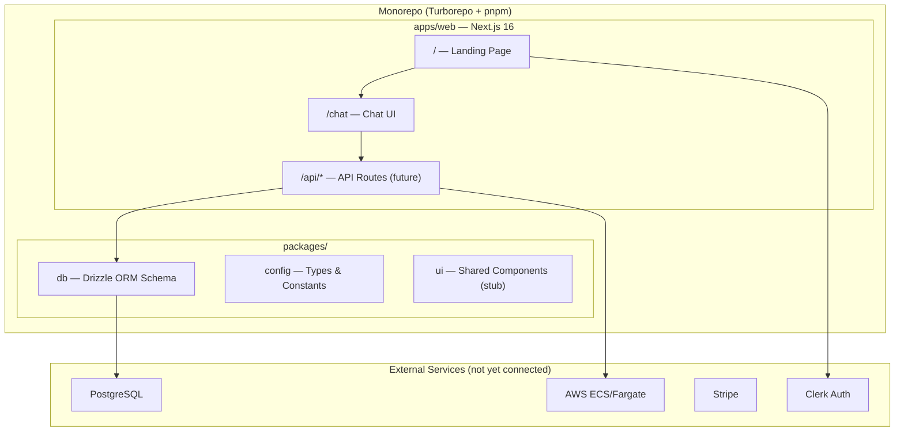

# Phase 1: Foundation — Walkthrough

## What Was Built

The EasyClaw monorepo has been scaffolded with all foundational pieces in place.

### Architecture



### Directory Structure

```
EasyClaw/
├── apps/web/                    # Next.js 16 + Tailwind CSS
│   └── src/app/
│       ├── layout.tsx           # Root layout (Inter font, dark mode)
│       ├── page.tsx             # Landing page (hero + features)
│       ├── chat/page.tsx        # Chat UI (Vercel-style)
│       └── globals.css          # Design system (custom properties)
├── packages/
│   ├── db/                      # Database layer
│   │   ├── src/schema.ts        # 4 tables: users, containers, usage_logs, api_keys
│   │   ├── src/index.ts         # DB client export
│   │   └── drizzle.config.ts    # Migration config
│   └── config/
│       └── src/index.ts         # Shared types (ChatMessage, UserProfile, ContainerStatus)
├── .env.example                 # All env vars documented
├── .gitignore
├── package.json                 # Root (turbo + prettier)
├── pnpm-workspace.yaml
├── turbo.json
└── README.md
```

### Database Schema

| Table | Key Columns | Purpose |
|-------|-------------|---------|
| `users` | `clerk_id`, `email`, `credits_balance` | User accounts, $1.00 free tier |
| `containers` | `user_id`, `status`, `task_arn` | One container per user, lifecycle tracking |
| `usage_logs` | `user_id`, `tokens_in/out`, `cost_usd`, `model` | Per-message cost attribution |
| `api_keys` | `user_id`, `key_hash` | Future: external API access |

---

## Verification Results

| Check | Status |
|-------|--------|
| `pnpm install` | ✅ All dependencies resolved |
| `pnpm --filter web dev` | ✅ Next.js 16.1.6 started, ready in 1.3s |
| Landing page (`/`) | ✅ Compiled (needs manual visual check) |
| Chat page (`/chat`) | ✅ Compiled (needs manual visual check) |

---

## Test Checklist (For You)

Run `pnpm dev` from the project root, then verify:

### Landing Page (`http://localhost:3000`)
- [ ] Page loads with dark theme
- [ ] "EasyClaw" logo + header visible
- [ ] Hero text: "Your Private AI Assistant" with gradient
- [ ] "Start Chatting — It's Free" button glows
- [ ] 6 feature cards render below the hero
- [ ] "Try It Free" button navigates to `/chat`
- [ ] Footer shows "© 2026 EasyClaw" and "Built at CMU 🎓"
- [ ] Mobile responsive (resize browser to phone width)

### Chat Page (`http://localhost:3000/chat`)
- [ ] Welcome message from assistant appears
- [ ] "Online" indicator visible in header
- [ ] "$1.00 credits" badge visible
- [ ] Type a message and press Enter → message appears as user bubble
- [ ] After 1.5s → mock assistant response appears
- [ ] Typing indicator (3 dots) shows during the 1.5s wait
- [ ] Timestamps visible on messages
- [ ] Messages auto-scroll to bottom
- [ ] Shift+Enter creates a newline (doesn't send)
- [ ] Send button is disabled when input is empty

### Project Structure
- [ ] `pnpm install` runs without errors
- [ ] `pnpm dev` starts the Next.js dev server
- [ ] No TypeScript errors in the terminal
